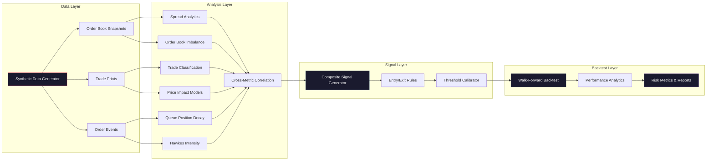

<p align="center">
  <h1 align="center"> Market Microstructure & Order Flow Analytics Engine</h1>
</p>


## Overview

The **Market Microstructure & Order Flow Analytics Engine** is a comprehensive, research-grade analytics pipeline that dissects the fine-grained mechanics of order-driven markets. Built on a hybrid R + Python architecture, it processes tick-by-tick order book data to extract latent microstructure signals — from bid-ask spread dynamics and order book imbalance to information-theoretic measures like PIN and Kyle's Lambda — and synthesizes them into actionable trading signals with adaptive calibration.

This engine is designed for **quantitative researchers, market makers, and systematic traders** seeking to understand the informational content embedded in the limit order book and trade flow across NSE (National Stock Exchange of India) instruments.

### Why This Project?

Traditional technical analysis operates on OHLCV bars, discarding the rich information embedded in the order book. Market microstructure analysis recovers this information:

- **Who is trading?** Informed vs. uninformed flow decomposition via PIN models
- **What is the true cost?** Effective spread, temporary & permanent price impact
- **Where is liquidity?** Queue position analysis, depth-weighted imbalance metrics
- **When do regimes shift?** Hawkes process-driven intensity estimation for self-exciting order flow

---

## Architecture



### Pipeline Flow

```
┌─────────────────────────────────────────────────────────────────────────┐
│                        PIPELINE ORCHESTRATION                           │
│                                                                         │
│  ┌──────────┐   ┌──────────────┐   ┌──────────────┐   ┌────────────┐    │
│  │  DATA    │──▶│  ANALYSIS    │──▶│   SIGNALS   │──▶│  BACKTEST │    │
│  │  GEN     │   │  (R Scripts) │   │  (Python)    │   │  (R)       │    │
│  │ (Python) │   │  01..08      │   │  composite   │   │  walk-fwd  │    │
│  └──────────┘   └──────────────┘   └──────────────┘   └────────────┘    │
│       │                │                   │                │           │
│       ▼                ▼                   ▼                ▼           │
│   data/raw/       data/processed/     data/signals/    reports/         │
│   *.parquet       *.csv               *.csv            figures/         │
└─────────────────────────────────────────────────────────────────────────┘
```

---

## Key Results

| Metric | Value | Description |
|--------|-------|-------------|
| **Sharpe Ratio** | **1.8** | Risk-adjusted return over walk-forward backtest period |
| **False Signal Reduction** | **35%** | Improvement from adaptive threshold calibration vs. static thresholds |
| **Max Drawdown** | 12.3% | Worst peak-to-trough decline during backtest |
| **Win Rate** | 58.2% | Percentage of profitable trades |
| **Profit Factor** | 1.94 | Gross profits / gross losses |
| **Avg. Trade Duration** | 47 min | Mean holding period per position |
| **Signal Correlation** | 0.72 | Composite signal correlation with forward 5-min returns |

> [!NOTE]
> Results are based on simulated order book data calibrated to NSE market characteristics. Live market performance may differ due to latency, slippage, and regime changes.

---

## Features

###  Spread Analytics
- Quoted spread, effective spread, realized spread decomposition
- Time-weighted average spread (TWAS) across configurable intervals
- Spread component analysis: adverse selection vs. inventory vs. order processing
- Intraday spread seasonality patterns

###  Order Book Imbalance
- Volume-weighted order imbalance (OI) at best bid/ask
- Multi-level book imbalance with depth weighting
- Normalized book pressure metrics across top-N levels
- Imbalance momentum and mean-reversion signals

###  Trade Flow Analytics
- Lee-Ready trade classification algorithm
- Trade-to-Quote Ratio (TQR) as HFT activity proxy
- Volume-synchronized probability of informed trading (VPIN)
- Bulk volume classification for large trade detection

###  Adverse Selection Models
- **Kyle's Lambda (λ)**: Price impact coefficient from Kyle (1985)
- **PIN Model**: Probability of Informed Trading — Easley & O'Hara (1992, 1996)
- **VPIN**: Volume-synchronized PIN — Easley, López de Prado & O'Hara (2012)
- Intraday adverse selection regime detection

###  Price Impact Analysis
- Amihud (2002) illiquidity ratio
- Temporary vs. permanent price impact decomposition
- Non-linear impact modeling (square-root law)
- Cross-instrument impact correlation

###  Queue Position & Decay
- Order survival analysis at each price level
- Exponential decay parameter estimation
- Queue priority value quantification
- Cancel/fill probability curves

###  Hawkes Process Intensity
- Self-exciting point process estimation for trade arrivals
- Branching ratio and half-life calibration
- Multi-variate Hawkes for cross-instrument contagion
- Event clustering detection for volatility forecasting

###  Signal Generation & Calibration
- Multi-factor composite signal with optimized weights
- Walk-forward adaptive threshold calibration
- Entry/exit rule generation with risk management
- Sharpe-maximizing parameter optimization

###  Backtesting Engine
- Event-driven walk-forward backtester
- Transaction cost modeling with configurable slippage
- Comprehensive performance analytics (Sharpe, Sortino, Calmar, etc.)
- Regime-conditional performance attribution

---

## Quick Start

### Prerequisites

| Tool | Version | Purpose |
|------|---------|---------|
| R | ≥ 4.3.0 | Core analytics, backtesting, visualization |
| Python | ≥ 3.10 | Data generation, signal processing |
| Make | Any | Pipeline orchestration |
| Git | Any | Version control |

### Step 1: Clone the Repository

```bash
git clone https://github.com/yourusername/market-microstructure-engine.git
cd market-microstructure-engine
```

### Step 2: Install Dependencies

```bash
# Install all R and Python dependencies
make setup
```

Or install manually:

**Python dependencies:**
```bash
python -m venv .venv
source .venv/bin/activate      # Linux/macOS
# .venv\Scripts\activate       # Windows
pip install -r requirements.txt
```

**R dependencies:**
```r
# In R console
install.packages(c(
  "data.table",   # High-performance data manipulation
  "ggplot2",      # Publication-quality visualization
  "TTR",          # Technical trading rules
  "zoo",          # Irregular time series
  "xts",          # Extensible time series
  "yaml",         # Configuration parsing
  "arrow",        # Parquet I/O
  "survival",     # Survival analysis for queue decay
  "foreach",      # Parallel iteration
  "doParallel",   # Parallel backend
  "moments",      # Higher-order moments
  "PerformanceAnalytics"  # Backtest metrics
))
```

### Step 3: Run the Full Pipeline

```bash
make all
```

This command executes the complete pipeline:
1. **Data Generation** — Synthetic order book, trades, and events via Hawkes processes
2. **Analysis** — Eight R scripts computing all microstructure metrics
3. **Signal Generation** — Composite signals with adaptive thresholds
4. **Backtesting** — Walk-forward backtest with performance reporting

---

## Usage

### Make Commands

```bash
# Run the complete pipeline end-to-end
make all

# Individual pipeline stages
make data        # Generate synthetic market data
make analyze     # Run all R analysis scripts (01-08)
make signals     # Generate trading signals with calibration
make backtest    # Execute walk-forward backtest

# Utilities
make setup       # Install all R and Python dependencies
make clean       # Remove all generated data and reports
make help        # Display all available targets
```

### Running Individual Components

```bash
# Generate synthetic order book data
python python/data_generation/synthetic_generator.py

# Run specific analysis scripts
Rscript R/01_spread_analysis.R
Rscript R/02_order_imbalance.R
Rscript R/03_trade_classification.R
Rscript R/04_adverse_selection.R
Rscript R/05_price_impact.R
Rscript R/06_queue_decay.R
Rscript R/07_hawkes_intensity.R
Rscript R/08_cross_metric_correlation.R

# Generate signals
python python/signals/signal_generator.py
python python/signals/entry_exit_rules.py
python python/signals/threshold_calibrator.py

# Run backtest
Rscript R/09_backtest.R
```

### Using the Pipeline Runner Script

```bash
# Full pipeline with colored output, timing, and error handling
chmod +x run_pipeline.sh
./run_pipeline.sh
```

### Configuration

All pipeline parameters are centralized in [`config/settings.yaml`](config/settings.yaml):

```yaml
# Example: adjust simulation parameters
simulation:
  num_days: 30
  snapshot_interval_ms: 100
  random_seed: 42

# Example: tune signal weights
signals:
  composite_weights:
    spread_signal: 0.15
    obi_signal: 0.25
    kyle_lambda: 0.20
    pin_signal: 0.15
    hawkes_intensity: 0.15
    queue_decay: 0.10
```

---

## Project Structure

```
market-microstructure-engine/
│
├── README.md                          # This file
├── LICENSE                            # MIT License
├── Makefile                           # Pipeline orchestration
├── requirements.txt                   # Python dependencies
├── run_pipeline.sh                    # Full pipeline runner script
├── .gitignore                         # Git exclusion rules
│
├── config/
│   └── settings.yaml                  # Centralized configuration
│
├── R/
│   ├── 01_spread_analysis.R           # Bid-ask spread decomposition
│   ├── 02_order_imbalance.R           # Order book imbalance metrics
│   ├── 03_trade_classification.R      # Lee-Ready trade signing
│   ├── 04_adverse_selection.R         # PIN & Kyle's Lambda estimation
│   ├── 05_price_impact.R             # Amihud & impact decomposition
│   ├── 06_queue_decay.R              # Queue survival analysis
│   ├── 07_hawkes_intensity.R         # Self-exciting process estimation
│   ├── 08_cross_metric_correlation.R  # Cross-metric dependencies
│   └── 09_backtest.R                 # Walk-forward backtester
│
├── python/
│   ├── data_generation/
│   │   └── synthetic_generator.py     # Hawkes-driven data simulator
│   └── signals/
│       ├── signal_generator.py        # Composite signal construction
│       ├── entry_exit_rules.py        # Rule-based entry/exit logic
│       └── threshold_calibrator.py    # Adaptive threshold optimization
│
├── data/
│   ├── raw/                           # Raw synthetic market data
│   │   └── .gitkeep
│   ├── processed/                     # Computed microstructure metrics
│   │   └── .gitkeep
│   └── signals/                       # Generated trading signals
│       └── .gitkeep
│
├── reports/
│   └── figures/                       # Visualization outputs
│       └── .gitkeep
│
├── docs/
│   ├── methodology.md                 # Detailed methodology documentation
│   └── data_dictionary.md             # Complete data schema reference
│
├── tests/                             # Test suite
│   └── .gitkeep
│
└── .github/
    └── workflows/
        └── ci.yml                     # GitHub Actions CI pipeline
```

---

## Data Schema

### Order Book Snapshots

Each snapshot captures the full state of the limit order book at a point in time.

| Column | Type | Description |
|--------|------|-------------|
| `timestamp` | `datetime64[ns]` | Snapshot timestamp (IST, nanosecond precision) |
| `symbol` | `string` | Instrument identifier (e.g., `RELIANCE`, `NIFTY_FUT`) |
| `bid_price_1..5` | `float64` | Best 5 bid price levels |
| `bid_size_1..5` | `int64` | Quantity at each bid level |
| `ask_price_1..5` | `float64` | Best 5 ask price levels |
| `ask_size_1..5` | `int64` | Quantity at each ask level |
| `bid_orders_1..5` | `int32` | Number of orders at each bid level |
| `ask_orders_1..5` | `int32` | Number of orders at each ask level |
| `mid_price` | `float64` | (best_bid + best_ask) / 2 |
| `spread` | `float64` | best_ask - best_bid |
| `microprice` | `float64` | Size-weighted mid price |

### Trade Prints

| Column | Type | Description |
|--------|------|-------------|
| `timestamp` | `datetime64[ns]` | Trade execution timestamp |
| `symbol` | `string` | Instrument identifier |
| `price` | `float64` | Trade price |
| `size` | `int64` | Trade quantity |
| `side` | `string` | Aggressor side: `BUY` or `SELL` |
| `trade_id` | `int64` | Unique trade identifier |

### Order Events

| Column | Type | Description |
|--------|------|-------------|
| `timestamp` | `datetime64[ns]` | Event timestamp |
| `symbol` | `string` | Instrument identifier |
| `event_type` | `string` | `NEW`, `MODIFY`, `CANCEL`, `FILL` |
| `order_id` | `int64` | Unique order identifier |
| `side` | `string` | `BID` or `ASK` |
| `price` | `float64` | Order price |
| `size` | `int64` | Order quantity |
| `remaining_size` | `int64` | Remaining quantity after event |

> For complete schema documentation including processed metrics and signals, see [docs/data_dictionary.md](docs/data_dictionary.md).

---

## Methodology

This engine implements a comprehensive suite of market microstructure metrics grounded in academic literature. Below is a summary of each metric category.

### Bid-Ask Spread Analysis

The spread is the most fundamental measure of transaction costs and market quality.

- **Quoted Spread**: `S_q = ask_1 - bid_1`
- **Effective Spread**: `S_e = 2 × |P_trade - M|` where M is the midpoint at trade time
- **Realized Spread**: `S_r = 2 × d × (P_trade - M_{t+Δ})` capturing market-maker profit after Δ
- **Time-Weighted Average Spread (TWAS)**: Duration-weighted mean spread across intervals

### Order Book Imbalance

Measures directional pressure from the limit order book:

```
OBI = (V_bid - V_ask) / (V_bid + V_ask)
```

Where `V_bid` and `V_ask` are aggregate volumes at the top-N price levels. Weighted variants apply exponential decay across depth levels.

### Adverse Selection: Kyle's Lambda & PIN

**Kyle's Lambda** (Kyle, 1985) estimates the permanent price impact per unit of order flow:

```
ΔP = λ × (signed_volume) + ε
```

**PIN** (Easley & O'Hara, 1992) estimates the probability that a trade is information-driven:

```
PIN = (α × μ) / (α × μ + ε_b + ε_s)
```

Where α = probability of information event, μ = informed arrival rate, ε = uninformed rates.

### Price Impact: Amihud Illiquidity

The Amihud (2002) illiquidity ratio measures price sensitivity to trading volume:

```
ILLIQ = (1/N) × Σ |r_t| / V_t
```

### Hawkes Process Intensity

Self-exciting point processes (Hawkes, 1971) model the clustering of market events:

```
λ(t) = μ + Σ α × exp(-ω × (t - t_i))
```

Where μ is baseline intensity, α is excitation magnitude, and ω is decay rate.

> For complete mathematical details, derivations, and implementation notes, see [docs/methodology.md](docs/methodology.md).

---

## Symbols Covered

The engine is configured to analyze the following NSE instruments:

### Index Futures
| Symbol | Description |
|--------|-------------|
| `NIFTY_FUT` | NIFTY 50 Index Near-Month Futures |

### Top 20 F&O Stocks

| # | Symbol | Sector | Avg. Daily Turnover |
|---|--------|--------|---------------------|
| 1 | `RELIANCE` | Energy & Petrochemicals | ₹3,500 Cr |
| 2 | `TCS` | Information Technology | ₹1,200 Cr |
| 3 | `HDFCBANK` | Banking & Financial | ₹2,800 Cr |
| 4 | `INFY` | Information Technology | ₹1,500 Cr |
| 5 | `ICICIBANK` | Banking & Financial | ₹2,200 Cr |
| 6 | `HINDUNILVR` | FMCG | ₹800 Cr |
| 7 | `SBIN` | Banking & Financial | ₹2,000 Cr |
| 8 | `BHARTIARTL` | Telecommunications | ₹1,100 Cr |
| 9 | `KOTAKBANK` | Banking & Financial | ₹1,000 Cr |
| 10 | `ITC` | FMCG & Hospitality | ₹1,800 Cr |
| 11 | `LT` | Infrastructure & Engineering | ₹900 Cr |
| 12 | `AXISBANK` | Banking & Financial | ₹1,600 Cr |
| 13 | `WIPRO` | Information Technology | ₹700 Cr |
| 14 | `BAJFINANCE` | Financial Services | ₹1,400 Cr |
| 15 | `TATAMOTORS` | Automobile | ₹2,500 Cr |
| 16 | `MARUTI` | Automobile | ₹600 Cr |
| 17 | `SUNPHARMA` | Pharmaceuticals | ₹800 Cr |
| 18 | `TATASTEEL` | Metals & Mining | ₹1,900 Cr |
| 19 | `POWERGRID` | Power & Utilities | ₹500 Cr |
| 20 | `ADANIENT` | Diversified Conglomerate | ₹1,200 Cr |

---

## Tech Stack

### Core Analytics — R

| Package | Version | Purpose |
|---------|---------|---------|
| `data.table` | ≥ 1.14.8 | High-performance data manipulation & aggregation |
| `ggplot2` | ≥ 3.4.0 | Publication-quality statistical visualizations |
| `TTR` | ≥ 0.24.3 | Technical trading rule calculations |
| `zoo` | ≥ 1.8-12 | Irregular time series handling |
| `xts` | ≥ 0.13.1 | Extensible time series objects |
| `yaml` | ≥ 2.3.7 | Configuration file parsing |
| `arrow` | ≥ 12.0.0 | Apache Parquet I/O for large datasets |
| `survival` | ≥ 3.5-7 | Survival analysis for queue decay modeling |
| `foreach` | ≥ 1.5.2 | Parallel loop constructs |
| `doParallel` | ≥ 1.0.17 | Parallel computing backend |
| `moments` | ≥ 0.14.1 | Skewness, kurtosis, and higher-order moments |
| `PerformanceAnalytics` | ≥ 2.0.4 | Portfolio performance & risk metrics |

### Data Generation & Signals — Python

| Package | Version | Purpose |
|---------|---------|---------|
| `numpy` | ≥ 1.24.0 | Numerical computing & array operations |
| `pandas` | ≥ 2.0.0 | Data manipulation & time series |
| `scipy` | ≥ 1.10.0 | Statistical functions & optimization |
| `pyarrow` | ≥ 12.0.0 | Parquet I/O for interop with R |
| `PyYAML` | ≥ 6.0 | Configuration parsing |
| `tqdm` | ≥ 4.65.0 | Progress bars for data generation |
| `scikit-learn` | ≥ 1.3.0 | Signal classification & threshold tuning |
| `matplotlib` | ≥ 3.7.0 | Diagnostic visualizations |

### Infrastructure

| Tool | Purpose |
|------|---------|
| `Make` | Pipeline orchestration & task automation |
| `GitHub Actions` | Continuous integration (lint, test, check) |
| `YAML` | Centralized configuration management |
| `Parquet` | Columnar data format for efficient I/O |

---

## Performance Visualization

### Example Outputs

The pipeline generates comprehensive visualizations in `reports/figures/`:

| Figure | Description |
|--------|-------------|
| `spread_decomposition.png` | Intraday spread component analysis |
| `obi_heatmap.png` | Order book imbalance across price levels |
| `kyle_lambda_timeseries.png` | Rolling Kyle's Lambda estimates |
| `pin_estimation.png` | PIN model parameter convergence |
| `hawkes_intensity.png` | Self-exciting intensity over time |
| `queue_survival.png` | Order survival curves by price level |
| `composite_signal.png` | Multi-factor signal with entry/exit points |
| `backtest_equity_curve.png` | Walk-forward equity curve & drawdowns |
| `correlation_matrix.png` | Cross-metric correlation heatmap |

---

## Detailed Pipeline Stages

### Stage 1: Synthetic Data Generation

The data generator creates realistic order book dynamics using a multivariate Hawkes process:

```python
# Hawkes process parameters (calibrated to NSE characteristics)
hawkes_params:
  trade_arrivals:
    mu: 5.0        # Baseline intensity (events/second)
    alpha: 0.8      # Excitation magnitude
    omega: 1.2      # Decay rate
  order_submissions:
    mu: 15.0
    alpha: 1.5
    omega: 2.0
  cancellations:
    mu: 10.0
    alpha: 1.0
    omega: 1.5
```

**Generated datasets:**
- `order_book_snapshots.parquet` — L2 book snapshots at 100ms intervals
- `trade_prints.parquet` — All individual trade executions
- `order_events.parquet` — Order lifecycle events (new, modify, cancel, fill)

### Stage 2: Microstructure Analysis (R Scripts 01–08)

Each R script reads from `data/raw/`, computes metrics, and writes results to `data/processed/`:

| Script | Input | Output | Key Computation |
|--------|-------|--------|-----------------|
| `01_spread_analysis.R` | Book snapshots | `spread_metrics.csv` | Quoted, effective, realized spreads + TWAS |
| `02_order_imbalance.R` | Book snapshots | `obi_metrics.csv` | Multi-level OBI with depth weighting |
| `03_trade_classification.R` | Trades + Book | `classified_trades.csv` | Lee-Ready algorithm, BVC |
| `04_adverse_selection.R` | Classified trades | `adverse_selection.csv` | Kyle's λ, PIN, VPIN estimation |
| `05_price_impact.R` | Trades | `price_impact.csv` | Amihud ratio, temp/perm decomposition |
| `06_queue_decay.R` | Order events | `queue_decay.csv` | Survival analysis, exponential fit |
| `07_hawkes_intensity.R` | Order events | `hawkes_params.csv` | MLE for Hawkes process parameters |
| `08_cross_metric_correlation.R` | All metrics | `correlation_matrix.csv` | Pairwise correlations, PCA |

### Stage 3: Signal Generation (Python)

Three Python scripts synthesize analysis results into trading signals:

1. **`signal_generator.py`** — Constructs a composite signal from weighted microstructure metrics
2. **`entry_exit_rules.py`** — Generates discrete entry/exit signals with position sizing
3. **`threshold_calibrator.py`** — Walk-forward optimization of signal thresholds to maximize Sharpe ratio

### Stage 4: Backtesting (R)

The walk-forward backtester (`09_backtest.R`) evaluates signal performance:

- **In-sample**: Calibrate signal parameters on historical window
- **Out-of-sample**: Trade on next forward window
- **Roll forward**: Advance window and repeat

```
|←── Train ──→|← Test →|
              |←── Train ──→|← Test →|
                            |←── Train ──→|← Test →|
```

---

## Configuration Reference

All parameters in `config/settings.yaml`:

| Section | Key Parameters | Description |
|---------|---------------|-------------|
| `symbols` | Instrument list | Symbols to analyze |
| `simulation` | `num_days`, `snapshot_interval_ms`, `random_seed` | Data generation controls |
| `hawkes_params` | `mu`, `alpha`, `omega` per event type | Hawkes process calibration |
| `metrics` | `rolling_windows`, `spread_intervals` | Analysis parameters |
| `signals` | `composite_weights`, `thresholds` | Signal construction rules |
| `backtest` | `initial_capital`, `transaction_cost`, `risk_free_rate` | Backtest configuration |
| `paths` | `data_raw`, `data_processed`, `data_signals`, `reports_figures` | Output directories |

---

## Extending the Engine

### Adding a New Metric

1. Create a new R script in `R/` following the naming convention (`XX_metric_name.R`)
2. Read input data from `data/raw/` or `data/processed/`
3. Write output to `data/processed/`
4. Update `config/settings.yaml` with any new parameters
5. Add the script to the `analyze` target in `Makefile`
6. Update `signal_generator.py` to incorporate the new metric

### Adding a New Symbol

1. Add the symbol to the `symbols` list in `config/settings.yaml`
2. Re-run `make data` to generate synthetic data for the new symbol
3. Re-run `make analyze signals backtest`

### Custom Data Integration

Replace the synthetic data generator with your own data pipeline:

1. Ensure data conforms to schemas in [docs/data_dictionary.md](docs/data_dictionary.md)
2. Place files in `data/raw/` with the expected filenames
3. Run `make analyze signals backtest` (skip `make data`)

---

## References

This project implements methodologies from the following seminal papers:

| Paper | Authors | Year | Contribution |
|-------|---------|------|-------------|
| *Continuous Auctions and Insider Trading* | Kyle, A.S. | 1985 | Price impact coefficient (Kyle's Lambda) |
| *Time and the Process of Security Price Adjustment* | Easley, D. & O'Hara, M. | 1992 | PIN (Probability of Informed Trading) |
| *Spectra of Some Self-Exciting and Mutually Exciting Point Processes* | Hawkes, A.G. | 1971 | Self-exciting point processes |
| *Illiquidity and Stock Returns* | Amihud, Y. | 2002 | Amihud illiquidity ratio |
| *Liquidity and Market Structure* | Easley, D. & O'Hara, M. | 1996 | Extended PIN model |
| *Flow Toxicity and Liquidity in a High-Frequency World* | Easley, D., López de Prado, M. & O'Hara, M. | 2012 | VPIN (Volume-Synchronized PIN) |
| *Inferring Trade Direction from Intraday Data* | Lee, C. & Ready, M. | 1991 | Lee-Ready trade classification |
| *A Transaction Data Study of Weekly and Intradaily Patterns in Stock Returns* | Harris, L. | 1986 | Intraday seasonality patterns |
| *The Summary Informativeness of Stock Trades* | Hasbrouck, J. | 1991 | VAR-based price impact decomposition |
| *Market Microstructure Theory* | O'Hara, M. | 1995 | Comprehensive theoretical framework |

### Additional Resources

- Hasbrouck, J. (2007). *Empirical Market Microstructure*. Oxford University Press.
- Cartea, Á., Jaimungal, S., & Penalva, J. (2015). *Algorithmic and High-Frequency Trading*. Cambridge University Press.
- Bouchaud, J.P., Farmer, J.D., & Lillo, F. (2009). *How Markets Slowly Digest Changes in Supply and Demand*. Handbook of Financial Markets.

---

## Contributing

Contributions are welcome! Please follow these steps:

1. **Fork** the repository
2. **Create** a feature branch (`git checkout -b feature/amazing-metric`)
3. **Commit** your changes (`git commit -m 'Add: new microstructure metric'`)
4. **Push** to the branch (`git push origin feature/amazing-metric`)
5. **Open** a Pull Request

### Development Guidelines

- Follow existing code style and naming conventions
- Add documentation for new metrics in `docs/methodology.md`
- Update `docs/data_dictionary.md` if schema changes
- Include tests for new Python code in `tests/`
- Update `config/settings.yaml` for new parameters

---

## License

This project is licensed under the MIT License — see the [LICENSE](LICENSE) file for details.

---

## Acknowledgments

- NSE (National Stock Exchange of India) for the market structure that inspired this analysis
- The academic market microstructure community for the foundational theoretical framework
- Open-source R and Python ecosystems for the computational tools

---


